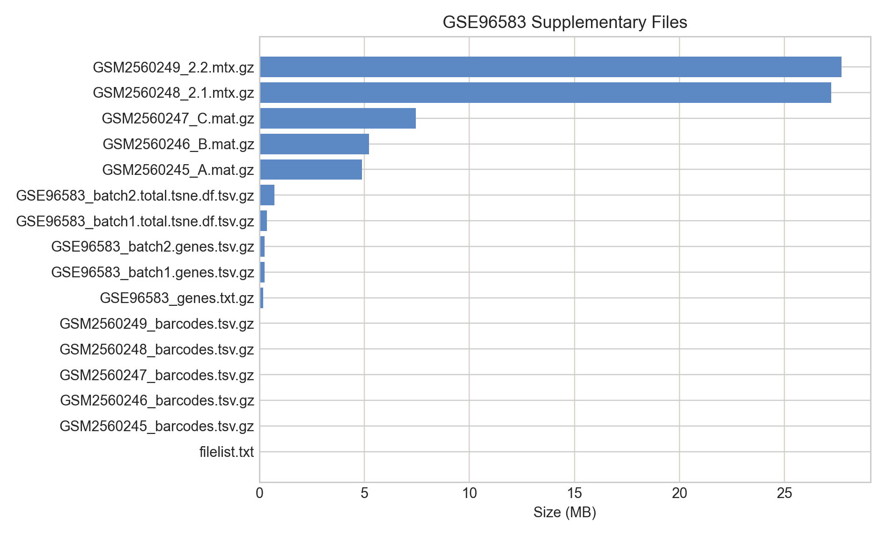
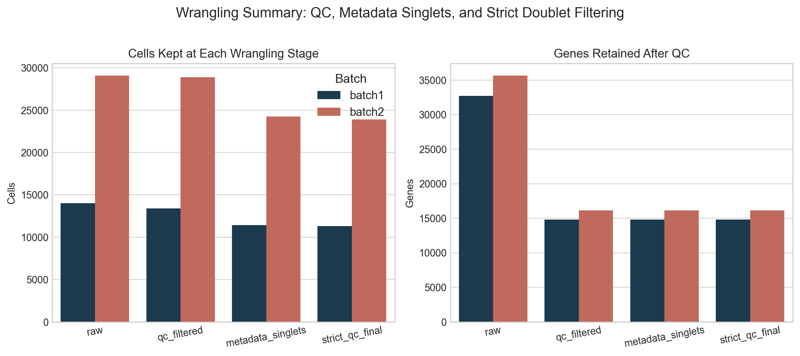
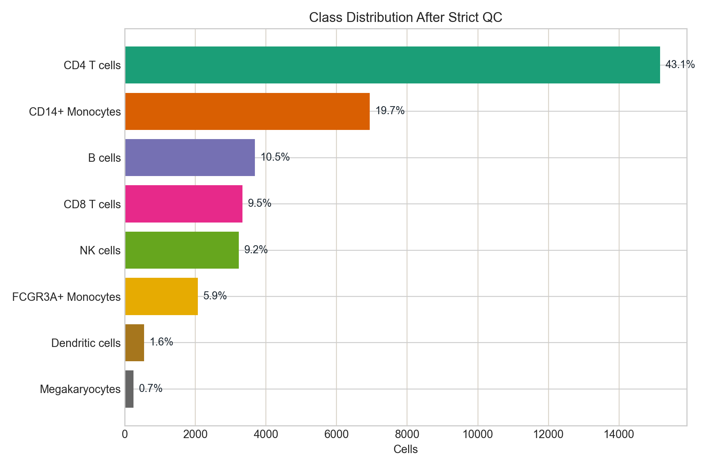
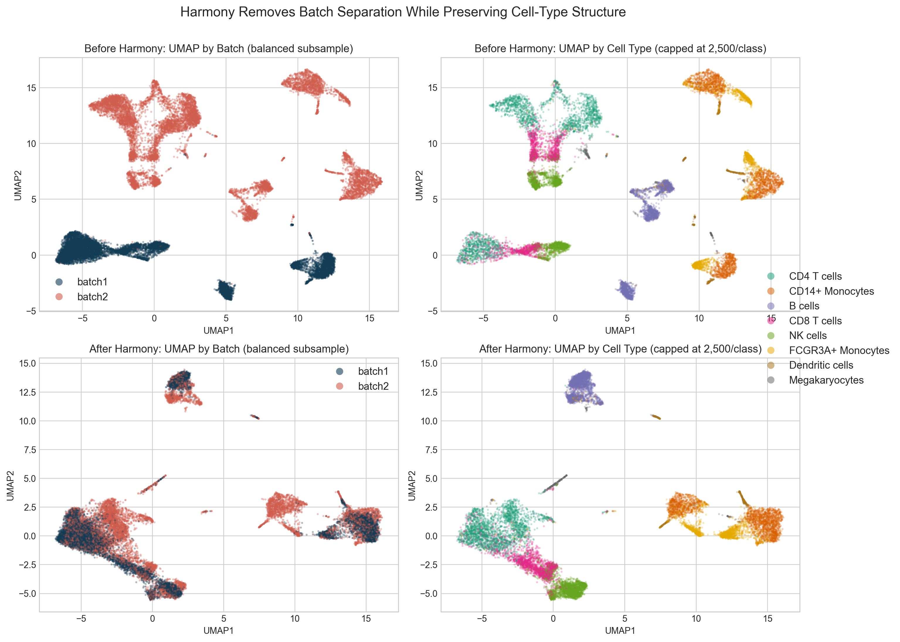
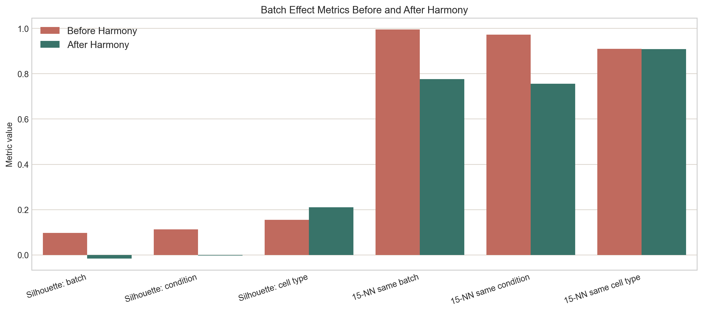
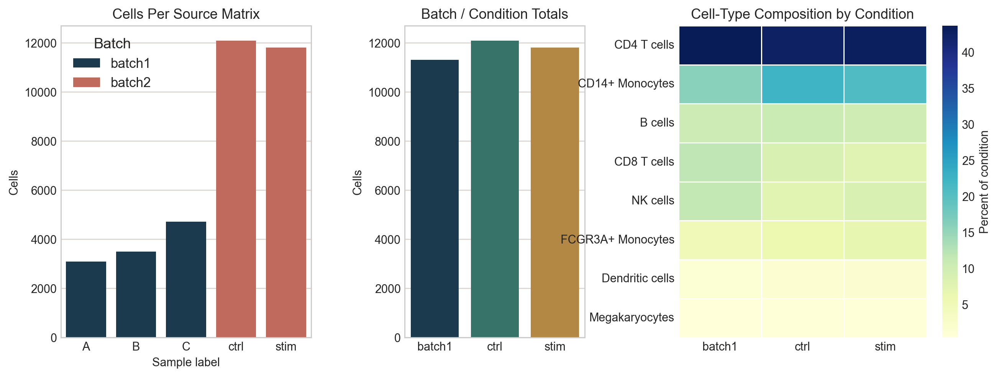
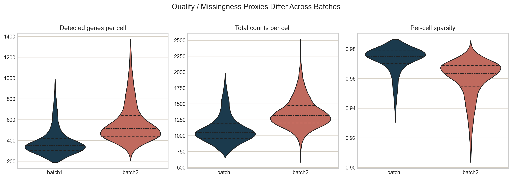

# MS2 Sections 1-2 Slides

## Slide 1: Data Source and Why GSE96583
- Source: GEO accession `GSE96583`, *Multiplexing droplet-based single cell RNA-sequencing using genetic barcodes*.
- The study gives us five PBMC supplementary matrices, usable cell-type labels, and both batch and condition shift inside one public benchmark.
- `batch1` consists of samples `A`, `B`, and `C`; `batch2` consists of `ctrl` and `stim`.
- This lets us tell a clean wrangling story before moving on to baseline modeling and SSL.

## Slide 2: GEO File Structure
- The raw GEO release is fragmented across count matrices, barcode files, gene tables, and cell metadata tables.
- `GSE96583_RAW.tar` only contains matrices + barcodes, so the metadata TSVs must be downloaded separately from the supplementary directory.
- That fragmented file structure is why explicit data wrangling is necessary.

## Slide 3: Data Wrangling Pipeline
- Step 1: download the archive plus the batch-specific gene and metadata tables.
- Step 2: load each matrix, align barcodes, and attach GEO metadata.
- Step 3: apply QC (`min_genes >= 200`, `min_cells >= 3`) and keep metadata singlets.
- Step 4: run strict residual doublet filtering with Scrublet plus conservative tail trimming.
- Step 5: align `batch1` and `batch2` on 14222 post-QC shared genes for cross-batch EDA.
- Final sizes: `batch1 = 11,308` cells, `batch2 = 23,906` cells.

## Slide 4: Class Distribution and Rare Classes
- The processed dataset preserves the main immune populations needed for downstream classification.
- The class distribution is clearly imbalanced, so later evaluation should emphasize macro-F1 and per-class behavior.
- Rare classes under 2% of the final benchmark: Dendritic cells, Megakaryocytes.

## Slide 5: Batch Effect Before Correction
- Before correction, the shared-gene UMAP is strongly separated by batch.
- Quantitatively, `silhouette_batch = 0.0976` before Harmony.
- This is exactly the problem we want milestone 2 to surface and fix.

## Slide 6: Harmony Batch Correction
- Harmony is a strong batch-correction method that is most commonly introduced in the R / Seurat ecosystem.
- We use the Python wrapper `harmonypy` so the notebook can stay end-to-end reproducible in Python.
- After Harmony, `silhouette_batch` drops to `-0.0163`, while `silhouette_cell_type` improves from `0.1554` to `0.2106`.

## Slide 7: Composition and QC Context
- `batch2` is nearly balanced between `ctrl` and `stim`, while `batch1` contributes three separate source matrices.
- QC metrics also differ by batch, so the benchmark includes both technical and biological variation.

